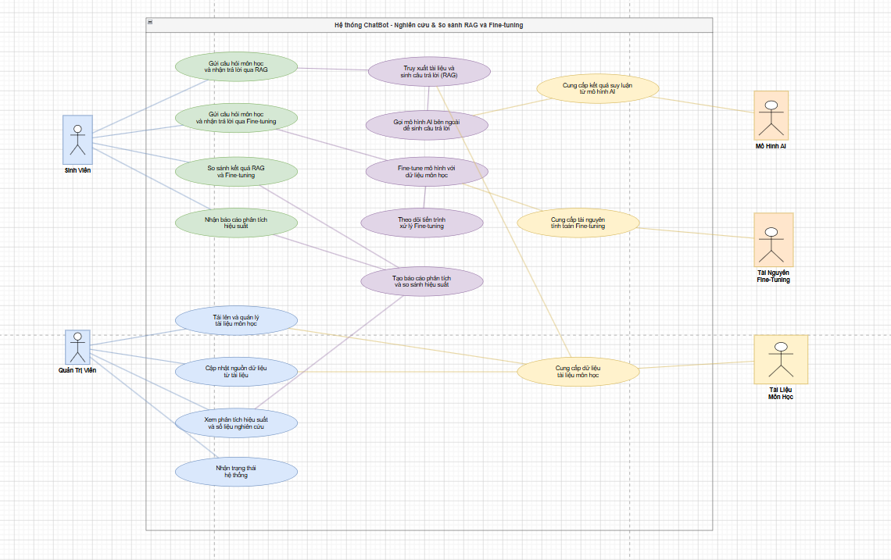
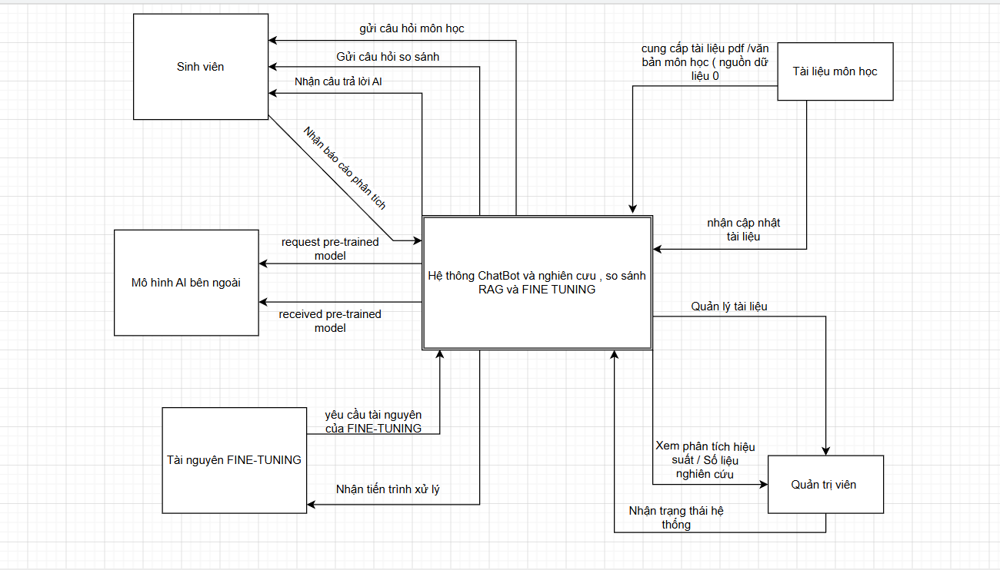
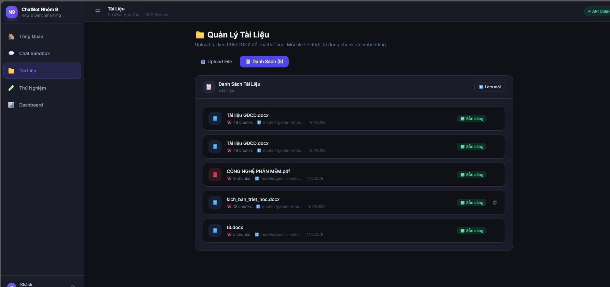
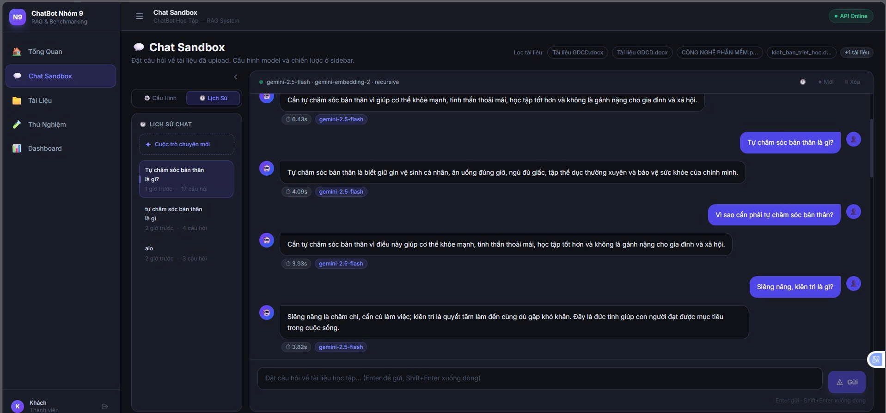
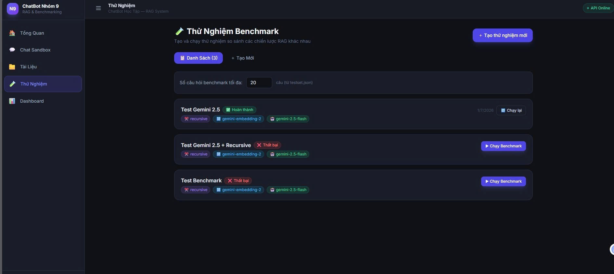
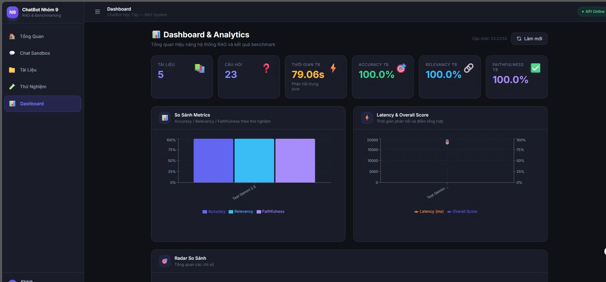

# Báo Cáo Tổng Kết Đồ Án: Hệ Thống ChatBot Học Tập Nhóm 9
*(Tích hợp RAG & Benchmarking so sánh Chunking Strategies & Embedding Models)*

## 1. Giới Thiệu Dự Án & Công Nghệ Sử Dụng

### 1.1 Giới thiệu dự án
Hệ thống ChatBot Nhóm 9 là một ứng dụng hỗ trợ học tập thông minh dành cho sinh viên. Hệ thống cho phép người dùng tải lên các tài liệu học tập (PDF, DOCX) và đặt câu hỏi. Chatbot sẽ dựa trên nội dung tài liệu để trả lời một cách chính xác nhờ vào công nghệ **RAG (Retrieval-Augmented Generation)**. Đồng thời, hệ thống cung cấp môi trường Benchmark để đánh giá và so sánh hiệu năng của các mô hình Embedding (multilingual-e5, PhoBERT, OpenAI...) và các chiến lược Chunking (Fixed-size, Semantic, Recursive).

### 1.2 Công nghệ sử dụng
- **Frontend:** React.js, Tailwind CSS, Recharts, Axios, React Router.
- **Backend:** FastAPI (Python), SQLAlchemy, LangChain, RAGAS (đánh giá).
- **Cơ sở dữ liệu:** MySQL (lưu dữ liệu có cấu trúc), ChromaDB (Vector Database lưu embeddings).
- **Quản lý & DevOps:** Git, GitHub, Jira, Postman.

---

## 2. Tài Liệu Đặc Tả Yêu Cầu Phần Mềm (SRS)

### 2.1 Mục đích
Xây dựng một hệ thống chatbot thông minh có khả năng trích xuất thông tin từ tài liệu học tập tiếng Việt, giúp sinh viên tra cứu kiến thức nhanh chóng. Đồng thời cung cấp công cụ cho quản trị viên/nghiên cứu viên đánh giá hiệu năng của các kỹ thuật xử lý dữ liệu RAG.

### 2.2 Phạm vi
- Hỗ trợ xử lý định dạng PDF và DOCX.
- Áp dụng kỹ thuật RAG với các LLM (GPT-4o-mini, Gemini...).
- Quản lý lịch sử chat và tài liệu tải lên theo từng người dùng.
- Thống kê, báo cáo và so sánh hiệu suất bằng biểu đồ.

### 2.3 Yêu cầu chức năng
- **Quản lý tài khoản:** Đăng nhập, đăng ký, đăng nhập với tư cách khách.
- **Quản lý tài liệu:** Kéo thả upload tài liệu, tự động chunking & embedding, xem danh sách và trạng thái tài liệu.
- **Tương tác Chat:** Chatbot trả lời câu hỏi dựa trên ngữ cảnh tài liệu, hiển thị thời gian phản hồi (latency), trích dẫn nguồn (context sources).
- **Cấu hình & Thử nghiệm (Benchmark):** Cho phép cấu hình Embedding model, Chunking strategy và AI model; chạy tập test (`testset.json`) để lấy điểm đánh giá.
- **Báo cáo (Dashboard):** Xem thống kê tổng quan (số tài liệu, câu hỏi), xem biểu đồ so sánh các chỉ số (Accuracy, Relevancy, Faithfulness, Latency).

### 2.4 Yêu cầu phi chức năng
- **Bảo mật:** Mật khẩu mã hóa Bcrypt, xác thực bằng JWT Token.
- **Hiệu năng:** Thời gian phản hồi API chat (latency) mong đợi dưới 5 giây.
- **Khả năng mở rộng:** Kiến trúc Clean Architecture ở Backend giúp dễ dàng thêm mới các AI Model hoặc Vector DB khác.
- **Tính khả dụng:** Giao diện Responsive, dễ sử dụng.

---

## 3. Thiết Kế Hệ Thống & Sơ Đồ
### 3.1 Các Sơ Đồ Thiết Kế
### 3.1.1 Sơ đồ Use Case


**Giải thích luồng hoạt động:** 
Sinh viên có thể gửi câu hỏi, hệ thống sẽ sử dụng RAG hoặc Fine-tuning (nếu có) để truy xuất dữ liệu từ các tài liệu môn học và gọi mô hình AI bên ngoài để sinh câu trả lời. Quản trị viên chịu trách nhiệm quản lý tài liệu, cập nhật nguồn dữ liệu và xem các báo cáo phân tích hiệu suất hệ thống.

---

### 3.1.2 Sơ đồ Kiến trúc Tổng Quan


**Giải thích luồng hoạt động:**
Tài liệu sau khi được người dùng tải lên sẽ qua quá trình Ingestion (Cắt nhỏ - Chunking và nhúng vector - Embedding), sau đó lưu vào ChromaDB. Khi user đặt câu hỏi, hệ thống truy vấn vector tương đồng (Retrieval), kết hợp với Prompt và gửi cho LLM (GPT-4o-mini/Gemini). Câu trả lời cuối cùng được trả về cho người dùng và lưu vào MySQL.

---

### 3.1.3 Biểu đồ Lớp (Class Diagram)


---

### 3.1.4 Biểu đồ Thực thể Kết hợp (ERD)


**Giải thích luồng hoạt động (áp dụng chung cho Database):**
Cơ sở dữ liệu lưu trữ 6 thực thể chính: `Users` (Người dùng), `Documents` (Tài liệu), `Questions` (Câu hỏi), `Answers` (Câu trả lời), `Experiments` (Cấu hình thử nghiệm), và `Evaluations` (Kết quả đánh giá). Mỗi `Answer` liên kết với một `Question` và có thể có nhiều `Evaluations` đi kèm để đo đạc chất lượng câu trả lời.

### 3.2 Sơ đồ Luồng Đánh giá & Benchmark
*(Phần này sử dụng quy trình đã định nghĩa trong mã nguồn và RAGAS)*

**Giải thích luồng hoạt động:**
Dữ liệu test (`testset.json`) chứa 50+ câu hỏi và ground truth. Hệ thống sẽ chạy RAG cho từng câu hỏi, thu thập câu trả lời và context. Sau đó dùng thư viện RAGAS để tính toán 4 chỉ số (Accuracy, Relevancy, Faithfulness, Latency) và lưu vào database để phục vụ Dashboard.

---
## 4. Quá Trình Kiểm Thử & Đánh Giá

### 4.1 Kiểm thử các chức năng chính
- **Upload Tài liệu:** Kéo thả file PDF, hệ thống phân tách thành công các chunks và lưu vector. 
  - 
- **Tương tác Chatbot:** Đặt câu hỏi về nội dung vừa upload, chatbot phản hồi đúng trọng tâm, trích dẫn chuẩn xác trang/văn bản nguồn. 
  - 
- **Chạy Benchmark:** Chạy tập test 50 câu hỏi thành công không bị lỗi timeout. 
  - 
- **Dashboard:** Biểu đồ vẽ đúng dữ liệu so sánh giữa các model. 
  - 

### 4.2 Đánh giá và So sánh Mô hình (Kết quả Nghiên cứu)
- **So sánh RAG vs Fine-tuning (RQ Chính):** RAG chứng minh được tính hiệu quả cao hơn trong bối cảnh học tập do chi phí thấp, không cần train lại model, dữ liệu cập nhật tức thời từ tài liệu PDF tải lên. Độ chính xác thông tin (Faithfulness) của RAG cao do dựa trên ngữ cảnh thực tế.
- **Chiến lược Chunking:** Phương pháp **Recursive** cho kết quả Retrieval tốt nhất vì bảo toàn được ngữ nghĩa của câu, so với Fixed-size dễ bị cắt cụt từ.
- **Embedding Model:** Mô hình `multilingual-e5-base` và `bge-m3` cho kết quả tìm kiếm tiếng Việt rất tốt, cân bằng giữa chi phí (miễn phí/mã nguồn mở) và hiệu năng so với các mô hình trả phí.

---

## 5. Hướng Dẫn Cài Đặt & Khởi Chạy

### 5.1 Chạy Backend
Mở terminal, di chuyển vào thư mục backend và chạy server FastAPI:
```bash
cd C:\BÁO CÁO NHÓM\ChatBot-Nhom9-hoanchinh\backend
# Kích hoạt môi trường ảo (nếu có)
# venv\Scripts\activate
uvicorn app.api.main:app --reload --port 8000
```
API Docs sẽ có tại: `http://localhost:8000/docs`

### 5.2 Chạy Frontend
Mở một terminal khác, di chuyển vào thư mục frontend và khởi chạy React:
```bash
cd C:\BÁO CÁO NHÓM\ChatBot-Nhom9-hoanchinh\frontend
# Cài đặt thư viện nếu chạy lần đầu: npm install
npm run dev
```
Trang web sẽ chạy tại: `http://localhost:5173`

---

## 6. Quá Trình Quản Lý Dự Án

### 6.1 Quản lý Code với Git & GitHub
- **Kho lưu trữ:** Mã nguồn được lưu trữ tập trung trên GitHub tại repo `hungpl6528-cell/ChatBot-Nhom9`.
- **Chiến lược phân nhánh (Git Flow):** Toàn bộ nhóm tuân thủ quy trình tạo nhánh `feature/*` từ `develop`. Sau khi code xong, tạo **Pull Request (PR)** để review trước khi merge.
- **Thống kê:** Dự án có tổng cộng **48 commits**, **85 files changed**, với hơn **7,072 dòng code**. Các commit cuối cùng đã được merge thành công từ `develop` vào `main` đánh dấu sự hoàn thiện của phần mềm.

### 6.2 Quản lý Task với Jira
- Dự án được quản lý theo mô hình Agile/Scrum trên Jira.
- **Epics:** Chia làm các phần chính như Backend (Database, RAG Core, Benchmark), Frontend (Chat, Dashboard), Báo cáo & Nghiên cứu.
- **Tasks & Trạng thái:** Công việc của 7 thành viên được chia nhỏ thành các Sub-tasks. Các thẻ được di chuyển qua các cột `To Do` -> `In Progress` -> `Done` sát với tiến độ code trên GitHub.
