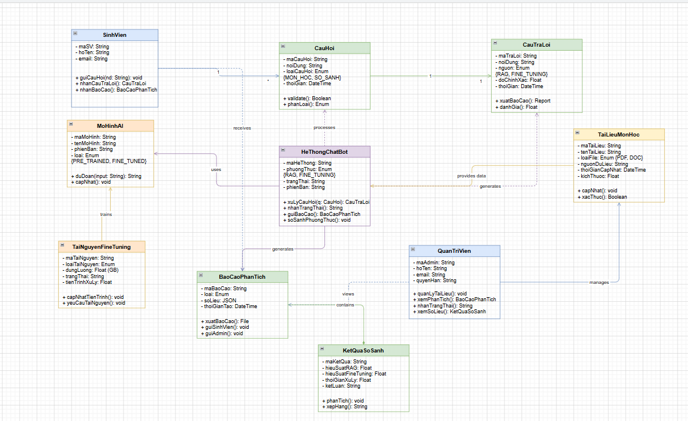
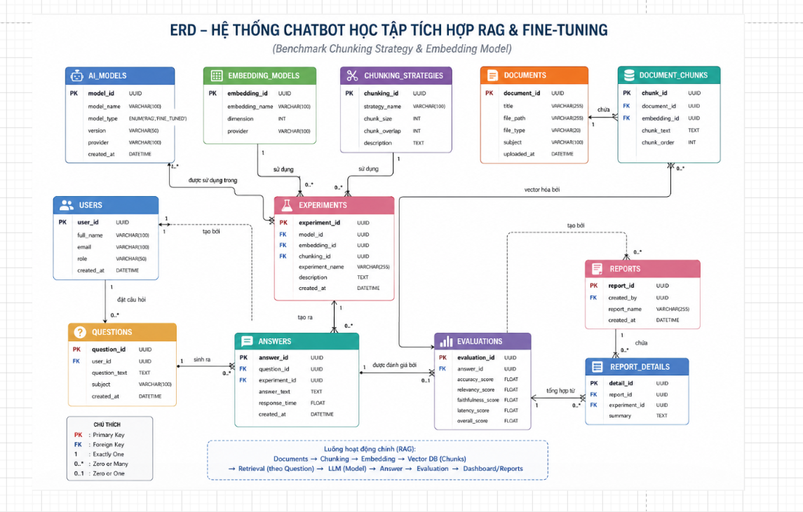
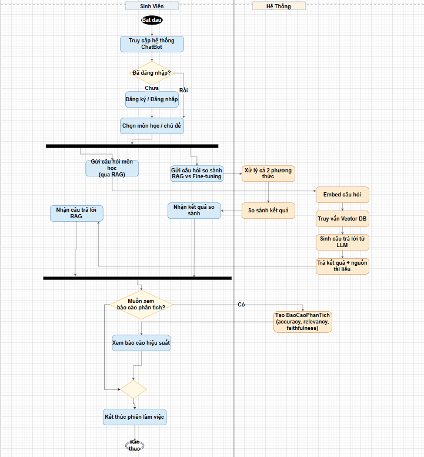
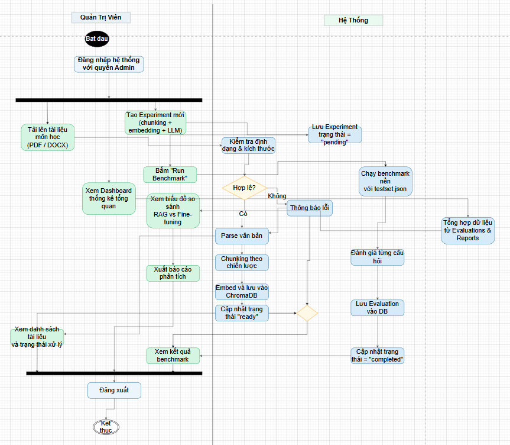
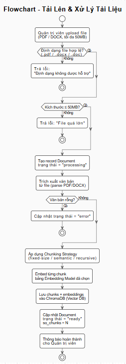
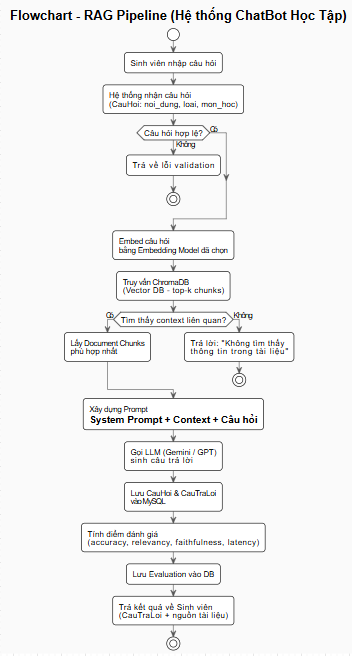
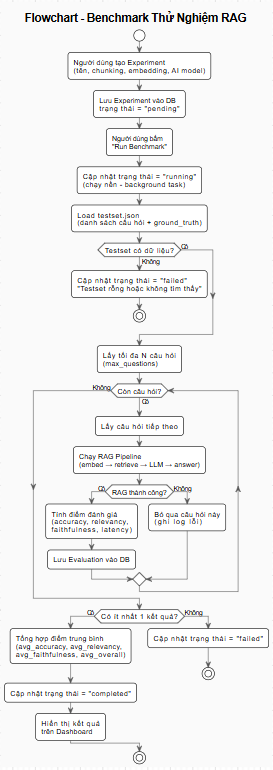

# Tài Liệu Đặc Tả Yêu Cầu Phần Mềm (SRS) - Phần Sơ Đồ
*(Các sơ đồ thiết kế cho Hệ thống ChatBot Nhóm 9)*

---

### 1. Sơ đồ Use Case

**Giải thích luồng hoạt động:** 
Sinh viên có thể gửi câu hỏi, hệ thống sẽ sử dụng RAG hoặc Fine-tuning (nếu có) để truy xuất dữ liệu từ các tài liệu môn học và gọi mô hình AI bên ngoài để sinh câu trả lời. Quản trị viên chịu trách nhiệm quản lý tài liệu, cập nhật nguồn dữ liệu và xem các báo cáo phân tích hiệu suất hệ thống.

---

### 2. Sơ đồ Kiến trúc Tổng Quan (Context Diagram)

**Giải thích luồng hoạt động:**
Tài liệu sau khi được người dùng tải lên sẽ qua quá trình Ingestion (Cắt nhỏ - Chunking và nhúng vector - Embedding), sau đó lưu vào ChromaDB. Khi user đặt câu hỏi, hệ thống truy vấn vector tương đồng (Retrieval), kết hợp với Prompt và gửi cho LLM (GPT-4o-mini/Gemini). Câu trả lời cuối cùng được trả về cho người dùng và lưu vào MySQL.

---

### 3. Biểu đồ Lớp (Class Diagram)

**Giải thích cấu trúc lớp:**
Biểu đồ lớp mô tả các thực thể chính trong hệ thống và mối quan hệ giữa chúng:

- **`User`**: Đại diện cho người dùng hệ thống (sinh viên hoặc quản trị viên). Chứa các thuộc tính như `id`, `username`, `email`, `role` và các phương thức `login()`, `logout()`.
- **`Document`**: Đại diện cho tài liệu môn học được tải lên. Liên kết với `User` (người tải lên) và chứa thông tin `filename`, `file_path`, `upload_date`, `status`.
- **`Chunk`**: Đoạn văn bản nhỏ được tách ra từ `Document` trong quá trình Chunking. Mỗi `Chunk` có một vector embedding tương ứng lưu trong ChromaDB.
- **`Question`**: Câu hỏi do sinh viên gửi lên. Liên kết với `User` (người hỏi) và chứa nội dung câu hỏi `content`, `timestamp`.
- **`Answer`**: Câu trả lời do LLM sinh ra, liên kết 1-1 với `Question`. Lưu `content`, `model_used`, `response_time` và danh sách `Chunk` đã được truy xuất làm context.
- **`Experiment`**: Cấu hình thử nghiệm, cho phép quản trị viên thiết lập các thông số như `model_name`, `chunk_size`, `top_k`, `temperature` để đánh giá hiệu suất.
- **`Evaluation`**: Kết quả đánh giá chất lượng của từng `Answer` theo từng `Experiment`, bao gồm các chỉ số `bleu_score`, `rouge_score`, `cosine_similarity`.

---

### 4. Biểu đồ Thực thể Kết hợp (ERD)

**Giải thích luồng hoạt động (áp dụng chung cho Database):**
Cơ sở dữ liệu lưu trữ 6 thực thể chính: `Users` (Người dùng), `Documents` (Tài liệu), `Questions` (Câu hỏi), `Answers` (Câu trả lời), `Experiments` (Cấu hình thử nghiệm), và `Evaluations` (Kết quả đánh giá). Mỗi `Answer` liên kết với một `Question` và có thể có nhiều `Evaluations` đi kèm để đo đạc chất lượng câu trả lời.

---

### 5. Biểu đồ Hoạt động Tổng Quan (Activity Diagram)

**Giải thích luồng hoạt động:**
Biểu đồ hoạt động tổng quan mô tả toàn bộ vòng đời tương tác trong hệ thống từ hai phía người dùng:

1. **Khởi động**: Người dùng truy cập hệ thống và thực hiện đăng nhập/xác thực.
2. **Phân nhánh theo vai trò**:
   - Nếu là **Sinh Viên** → Chuyển sang luồng đặt câu hỏi và nhận câu trả lời.
   - Nếu là **Quản Trị Viên** → Chuyển sang luồng quản lý tài liệu và cấu hình hệ thống.
3. **Luồng Sinh Viên**: Gửi câu hỏi → Hệ thống xử lý RAG → Nhận câu trả lời → Tùy chọn đánh giá chất lượng câu trả lời.
4. **Luồng Quản Trị Viên**: Tải lên/xóa tài liệu → Hệ thống cập nhật ChromaDB → Xem báo cáo/chạy benchmark.
5. **Kết thúc**: Người dùng đăng xuất, phiên làm việc kết thúc và dữ liệu được lưu vào MySQL.

---

### 6. Biểu đồ Hoạt động - Sinh Viên (Activity Diagram - Sinh Viên)

**Giải thích luồng hoạt động:**
Biểu đồ mô tả chi tiết toàn bộ hành trình của sinh viên khi tương tác với hệ thống:

1. **Đăng nhập**: Sinh viên nhập thông tin tài khoản. Hệ thống xác thực, nếu sai thông báo lỗi và yêu cầu nhập lại.
2. **Nhập câu hỏi**: Sau khi đăng nhập thành công, sinh viên nhập nội dung câu hỏi liên quan đến môn học vào giao diện chat.
3. **Xử lý câu hỏi (RAG Pipeline)**:
   - Hệ thống **Embedding** câu hỏi thành vector.
   - **Truy vấn ChromaDB** để tìm các đoạn văn bản (Chunk) liên quan nhất theo độ tương đồng cosine.
   - **Tổng hợp Prompt** từ câu hỏi + các Chunk context truy xuất được.
   - **Gửi Prompt đến LLM** (GPT-4o-mini hoặc Gemini) để sinh câu trả lời.
4. **Hiển thị kết quả**: Câu trả lời được trả về và hiển thị trong giao diện, kèm theo các nguồn tài liệu tham chiếu.
5. **Đánh giá phản hồi** *(tùy chọn)*: Sinh viên có thể đánh giá chất lượng câu trả lời (hữu ích / không hữu ích), kết quả được lưu lại để cải thiện hệ thống.
6. **Tiếp tục hoặc kết thúc**: Sinh viên có thể đặt câu hỏi mới hoặc đăng xuất.

---

### 7. Biểu đồ Hoạt động - Quản Trị Viên (Activity Diagram - Quản Trị Viên)

**Giải thích luồng hoạt động:**
Biểu đồ mô tả chi tiết các hành động quản trị của quản trị viên trong hệ thống:

1. **Đăng nhập với quyền Admin**: Quản trị viên đăng nhập bằng tài khoản có phân quyền `admin`, được cấp quyền truy cập vào bảng điều khiển quản lý.
2. **Quản lý Tài liệu**:
   - **Tải lên tài liệu mới**: Chọn file (PDF, DOCX,...) → Hệ thống kiểm tra định dạng → Thực hiện Chunking & Embedding → Lưu vector vào ChromaDB và metadata vào MySQL.
   - **Xóa tài liệu**: Chọn tài liệu cần xóa → Hệ thống xóa dữ liệu trong ChromaDB và cập nhật trạng thái trong MySQL.
3. **Cấu hình Thử nghiệm (Experiment)**: Thiết lập các thông số như model AI, kích thước chunk, số lượng chunk truy xuất (top-k), nhiệt độ sinh văn bản (temperature).
4. **Chạy Benchmark**: Chọn tập câu hỏi kiểm thử → Hệ thống chạy RAG Pipeline trên từng câu hỏi → Thu thập câu trả lời → Tính toán các chỉ số đánh giá (BLEU, ROUGE, Cosine Similarity).
5. **Xem Báo cáo**: Xem biểu đồ phân tích hiệu suất, so sánh kết quả giữa các cấu hình thử nghiệm khác nhau.
6. **Đăng xuất**: Kết thúc phiên quản trị.

---

### 8. Flowchart - Quy trình Upload Tài Liệu

**Giải thích luồng hoạt động:**
Mô tả chi tiết các bước xử lý khi quản trị viên tải một tài liệu mới lên hệ thống:

1. **Người dùng chọn file**: Quản trị viên chọn file tài liệu (hỗ trợ PDF, DOCX, TXT) từ máy tính.
2. **Kiểm tra hợp lệ**:
   - Kiểm tra định dạng file có được hỗ trợ không.
   - Kiểm tra kích thước file có vượt quá giới hạn cho phép không.
   - Nếu không hợp lệ → Thông báo lỗi, yêu cầu chọn lại file.
3. **Trích xuất nội dung**: Hệ thống đọc và trích xuất toàn bộ nội dung văn bản từ file.
4. **Chunking (Cắt nhỏ văn bản)**: Chia văn bản thành các đoạn nhỏ (chunk) theo kích thước cấu hình (ví dụ: 512 token/chunk) với độ chồng lấp (overlap) để giữ ngữ cảnh liên tục.
5. **Embedding (Nhúng vector)**: Mỗi chunk được đưa qua mô hình Embedding (ví dụ: `text-embedding-ada-002`) để tạo ra vector biểu diễn ngữ nghĩa.
6. **Lưu vào ChromaDB**: Các vector embedding cùng nội dung chunk và metadata được lưu vào cơ sở dữ liệu vector ChromaDB.
7. **Cập nhật MySQL**: Thông tin metadata của tài liệu (tên file, ngày tải, trạng thái) được lưu vào bảng `Documents` trong MySQL.
8. **Thông báo thành công**: Hệ thống xác nhận tài liệu đã được xử lý và sẵn sàng phục vụ tra cứu.

---

### 9. Flowchart - RAG Pipeline

**Giải thích luồng hoạt động:**
Mô tả chi tiết toàn bộ quy trình xử lý câu hỏi theo kiến trúc RAG (Retrieval-Augmented Generation):

1. **Nhận câu hỏi**: Hệ thống nhận câu hỏi dạng văn bản tự nhiên từ sinh viên qua giao diện chat.
2. **Embedding câu hỏi**: Câu hỏi được chuyển đổi thành vector embedding (cùng mô hình embedding đã dùng để index tài liệu) nhằm đảm bảo tính tương đồng trong không gian vector.
3. **Retrieval - Truy xuất Context**:
   - Tính toán độ tương đồng cosine giữa vector câu hỏi và toàn bộ vector chunk trong ChromaDB.
   - Lấy ra **top-k chunk** có điểm tương đồng cao nhất (mặc định k=5).
   - Lọc theo ngưỡng điểm tương đồng tối thiểu để loại bỏ context không liên quan.
4. **Xây dựng Prompt**: Ghép nối câu hỏi gốc + các chunk context đã truy xuất + các chỉ dẫn hệ thống (system prompt) thành một prompt hoàn chỉnh gửi cho LLM.
5. **Gọi LLM**: Prompt được gửi đến mô hình ngôn ngữ lớn (GPT-4o-mini hoặc Gemini) thông qua API. LLM sinh ra câu trả lời dựa trên context được cung cấp.
6. **Hậu xử lý**: Câu trả lời được kiểm tra, định dạng lại nếu cần và kèm theo danh sách nguồn tài liệu tham chiếu.
7. **Lưu lịch sử**: Câu hỏi, câu trả lời, danh sách chunk đã dùng và thời gian phản hồi được lưu vào MySQL.
8. **Trả kết quả**: Câu trả lời hiển thị cho sinh viên trên giao diện.

---

### 10. Flowchart - Benchmark & Đánh Giá

**Giải thích luồng hoạt động:**
Mô tả chi tiết quy trình đánh giá và so sánh hiệu suất (benchmark) giữa các cấu hình hệ thống khác nhau:

1. **Chuẩn bị Experiment**: Quản trị viên tạo một `Experiment` mới với cấu hình cụ thể: chọn mô hình AI (GPT-4o-mini/Gemini), chunk size, top-k, temperature.
2. **Chuẩn bị tập dữ liệu kiểm thử**: Tải lên hoặc chọn tập câu hỏi - câu trả lời chuẩn (ground truth) đã được định nghĩa trước.
3. **Chạy vòng lặp đánh giá**: Với mỗi câu hỏi trong tập kiểm thử:
   - Thực thi RAG Pipeline để lấy câu trả lời từ hệ thống.
   - So sánh câu trả lời nhận được với câu trả lời chuẩn (ground truth).
4. **Tính toán chỉ số**:
   - **BLEU Score**: Đo độ chính xác dựa trên n-gram trùng khớp giữa câu trả lời sinh ra và ground truth.
   - **ROUGE Score**: Đánh giá mức độ bao phủ nội dung (recall) của câu trả lời.
   - **Cosine Similarity**: Tính độ tương đồng ngữ nghĩa giữa vector embedding của câu trả lời và ground truth.
5. **Lưu kết quả**: Tất cả chỉ số được lưu vào bảng `Evaluations` trong MySQL, liên kết với `Experiment` và từng `Answer` cụ thể.
6. **Tổng hợp & Báo cáo**: Hệ thống tính trung bình các chỉ số trên toàn bộ tập kiểm thử và hiển thị biểu đồ so sánh giữa các lần chạy Experiment khác nhau, giúp quản trị viên chọn cấu hình tối ưu.
