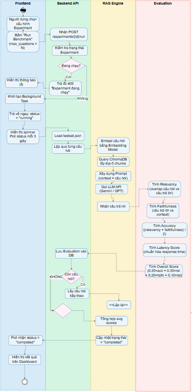

# Tài Liệu Đặc Tả Yêu Cầu Phần Mềm (SRS) - Phần Sơ Đồ
*(Các sơ đồ thiết kế cho Hệ thống ChatBot Nhóm 9)*

---

### 1. Sơ đồ Use Case

**Giải thích luồng hoạt động:** 
Sinh viên có thể gửi câu hỏi, hệ thống sẽ sử dụng RAG hoặc Fine-tuning (nếu có) để truy xuất dữ liệu từ các tài liệu môn học và gọi mô hình AI bên ngoài để sinh câu trả lời. Quản trị viên chịu trách nhiệm quản lý tài liệu, cập nhật nguồn dữ liệu và xem các báo cáo phân tích hiệu suất hệ thống.

---

### 2. Sơ đồ Kiến trúc Tổng Quan (Context Diagram)

**Giải thích luồng hoạt động:**
Tài liệu sau khi được người dùng tải lên sẽ qua quá trình Ingestion (Cắt nhỏ - Chunking và nhúng vector - Embedding), sau đó lưu vào ChromaDB. Khi user đặt câu hỏi, hệ thống truy vấn vector tương đồng (Retrieval), kết hợp với Prompt và gửi cho LLM (GPT-4o-mini/Gemini). Câu trả lời cuối cùng được trả về cho người dùng và lưu vào MySQL.

---

### 3. Biểu đồ Lớp (Class Diagram)

---

### 4. Biểu đồ Thực thể Kết hợp (ERD)

**Giải thích luồng hoạt động (áp dụng chung cho Database):**
Cơ sở dữ liệu lưu trữ 6 thực thể chính: `Users` (Người dùng), `Documents` (Tài liệu), `Questions` (Câu hỏi), `Answers` (Câu trả lời), `Experiments` (Cấu hình thử nghiệm), và `Evaluations` (Kết quả đánh giá). Mỗi `Answer` liên kết với một `Question` và có thể có nhiều `Evaluations` đi kèm để đo đạc chất lượng câu trả lời.

---

### 5. Biểu đồ Hoạt động Tổng Quan (Activity Diagram)

---

### 6. Biểu đồ Hoạt động - Sinh Viên (Activity Diagram - Sinh Viên)

**Giải thích luồng hoạt động:**
Mô tả chi tiết luồng tương tác của sinh viên với hệ thống: đăng nhập, gửi câu hỏi, nhận câu trả lời từ AI và đánh giá phản hồi.

---

### 7. Biểu đồ Hoạt động - Quản Trị Viên (Activity Diagram - Quản Trị Viên)

**Giải thích luồng hoạt động:**
Mô tả chi tiết luồng tương tác của quản trị viên: quản lý tài liệu, tải lên/xóa tài liệu môn học, theo dõi và đánh giá hiệu suất hệ thống.

---

### 8. Flowchart - Quy trình Upload Tài Liệu

**Giải thích luồng hoạt động:**
Quy trình tải tài liệu lên hệ thống: người dùng chọn file, hệ thống kiểm tra định dạng và kích thước, sau đó thực hiện Chunking và Embedding để lưu vào ChromaDB.

---

### 9. Flowchart - RAG Pipeline

**Giải thích luồng hoạt động:**
Quy trình xử lý câu hỏi theo RAG Pipeline: nhận câu hỏi từ user → Embedding câu hỏi → Truy vấn ChromaDB tìm đoạn văn bản liên quan → Kết hợp context với Prompt → Gửi cho LLM → Trả kết quả.

---

### 10. Flowchart - Benchmark & Đánh Giá

**Giải thích luồng hoạt động:**
Quy trình đánh giá và benchmark hệ thống: chạy tập câu hỏi thử nghiệm, thu thập câu trả lời từ mô hình, tính toán các chỉ số đánh giá (BLEU, ROUGE, Cosine Similarity) và lưu kết quả vào cơ sở dữ liệu.
